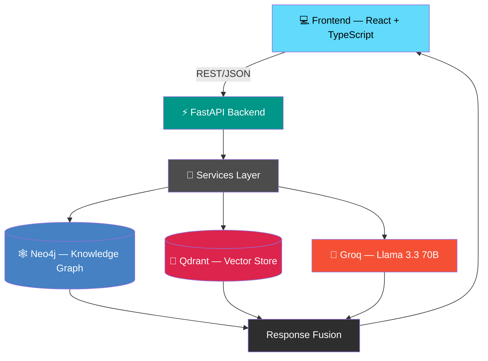
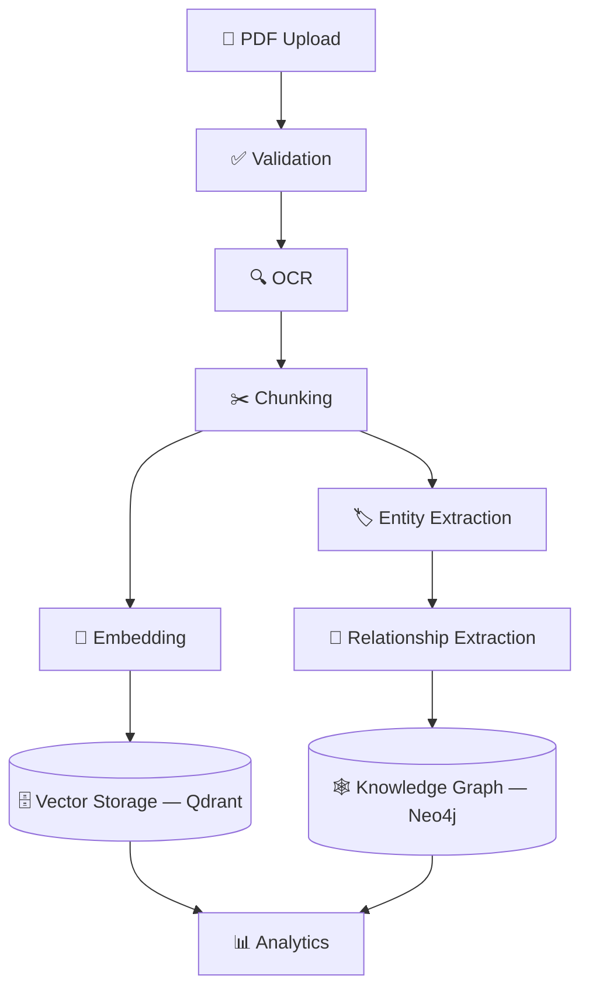
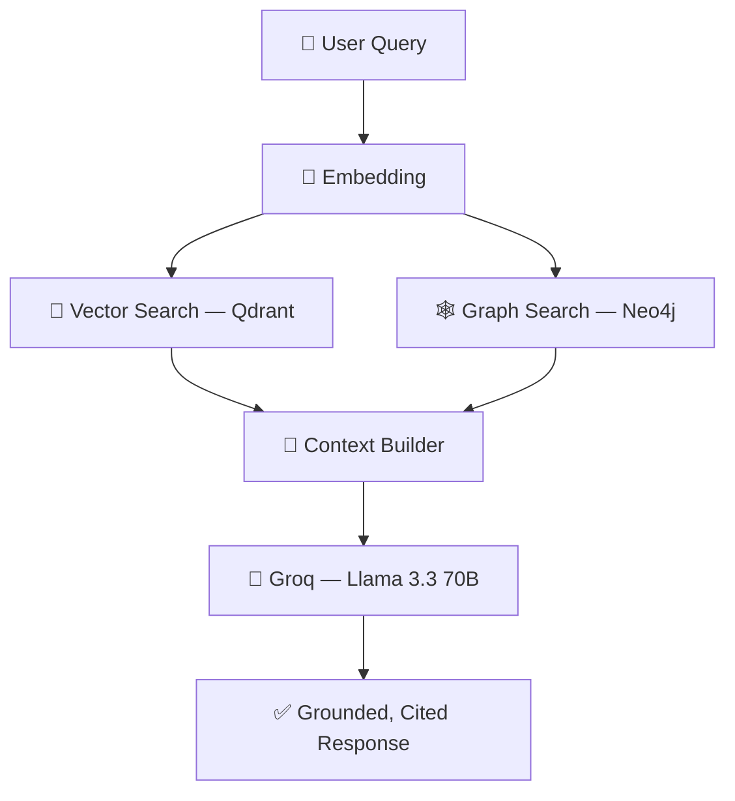

<div align="center">

# 🧠 Multi-Modal Knowledge Graph for Enterprise Compliance

### AI-powered Compliance Intelligence Platform using Hybrid Graph RAG

*Transform static compliance PDFs into a living, queryable Knowledge Graph.*

[](https://www.python.org/)
[](https://fastapi.tiangolo.com/)
[](https://react.dev/)
[](https://www.typescriptlang.org/)
[](https://neo4j.com/)
[](https://qdrant.tech/)
[](https://groq.com/)
[](#-license)
[](https://github.com/your-org/your-repo/commits)

</div>

---

## 📖 Overview

**Multi-Modal Knowledge Graph for Enterprise Compliance** is a production-ready AI platform that turns unstructured compliance documents into a structured, explorable **Knowledge Graph** — combining **Neo4j** graph reasoning with **Qdrant** vector search in a **Hybrid Graph RAG** architecture, all grounded by **Groq's Llama 3.3 70B**.

### Why it exists

Compliance teams live in PDFs. Policies, frameworks, and audit documents pile up in shared drives where the only way to "search" is `Ctrl+F`. That means:

- Relationships between policies, clauses, and frameworks stay invisible.
- Answers require manually reading dozens of pages.
- There's no way to ask a natural-language question and get a **grounded, cited** answer.
- Compliance coverage and risk are hard to visualize or quantify.

### What it solves

This platform ingests PDF documents, runs them through an **OCR → Chunking → Embedding → Entity Extraction → Relationship Extraction** pipeline, and produces:

- A **Knowledge Graph** in Neo4j capturing entities and their relationships
- A **Vector Index** in Qdrant for semantic retrieval
- An **AI Chat** interface that answers questions using both graph and vector context, with citations
- **Analytics** and a **Graph Explorer** for visual, interactive compliance insight

### Who it's for

- 🏢 **Enterprise compliance & risk teams** needing searchable, connected policy knowledge
- 🧑‍⚖️ **Auditors & legal teams** who need evidence-backed answers, not guesses
- 🧑‍💻 **Developers/researchers** exploring Graph RAG and hybrid retrieval architectures
- 🏆 **Hackathon judges & recruiters** evaluating applied GenAI + Graph engineering

---

## ✨ Key Features

<details open>
<summary><strong>📄 Document Intelligence</strong></summary>

- Secure PDF upload with validation
- Metadata extraction
- Multi-document support
- Document listing with status, entity counts, and relationship counts
- Document deletion

</details>

<details open>
<summary><strong>🔎 OCR Pipeline</strong></summary>

- PDF parsing via PyMuPDF / pdfplumber
- Text extraction
- Table extraction
- Page-wise processing

</details>

<details open>
<summary><strong>🕸️ Knowledge Graph Construction</strong></summary>

- Automatic entity extraction (LLM + rule-based NLP + spaCy)
- Relationship extraction
- Neo4j graph construction
- Entity normalization & deduplication
- Graph traversal & search
- Graph statistics and insights

</details>

<details open>
<summary><strong>🧬 Hybrid Graph + Vector RAG</strong></summary>

- Semantic vector search via Qdrant
- Knowledge Graph retrieval via Neo4j/Cypher
- Context builder that fuses both retrieval paths
- Citation-based, grounded responses via Groq

</details>

<details open>
<summary><strong>💬 AI Chat</strong></summary>

- Natural language querying over your document corpus
- Evidence-backed responses with source citations
- Related entity surfacing
- Confidence score and processing time per response

</details>

<details open>
<summary><strong>📊 Analytics Dashboard</strong></summary>

- Compliance score
- Framework coverage
- Graph statistics
- Node & relationship distribution
- AI-generated insights

</details>

<details open>
<summary><strong>🌐 Knowledge Graph Explorer</strong></summary>

- Interactive graph visualization (D3.js)
- Node inspector & relationship viewer
- Zoom, pan, neighbor highlighting
- Dynamic graph updates

</details>

<details open>
<summary><strong>🔐 Role-Based Access Control</strong></summary>

- JWT authentication
- Role-based access control (RBAC)
- Protected API routes

</details>

<details open>
<summary><strong>📁 Project Management</strong></summary>

- Compliance project workspaces
- Team collaboration

</details>

<details open>
<summary><strong>📑 Reports</strong></summary>

- AI-generated compliance reports
- Compliance summaries
- Analytics reports

</details>

---

## 🏗️ Architecture



The request flow is straightforward: the **React frontend** calls the **FastAPI backend**, which delegates to a **services layer**. Services orchestrate reads/writes across **Neo4j** (graph reasoning), **Qdrant** (semantic search), and **Groq** (LLM generation), then fuse the results into a single grounded response returned to the client.

---

## 🧰 Technology Stack

### Frontend

| Technology | Purpose |
|---|---|
| React 18 | UI framework |
| TypeScript | Type-safe application logic |
| Vite | Build tooling & dev server |
| React Query | Server-state management & caching |
| React Router | Client-side routing |
| Tailwind CSS | Utility-first styling |
| Lucide Icons | Icon system |
| D3.js | Knowledge Graph visualization |

### Backend

| Technology | Purpose |
|---|---|
| Python | Core language |
| FastAPI | Async API framework |
| Pydantic | Schema validation & serialization |
| Uvicorn | ASGI server |
| AsyncIO | Concurrent I/O |

### AI / NLP

| Technology | Purpose |
|---|---|
| Groq (Llama 3.3 70B Versatile) | Grounded response generation |
| Sentence Transformers | Text embeddings |
| spaCy | NLP / entity recognition |
| Rule-based NLP | Domain-specific extraction heuristics |

### Database

| Technology | Purpose |
|---|---|
| Neo4j Aura | Knowledge Graph store & Cypher queries |
| Qdrant Cloud | Vector similarity search |
| Filesystem | Uploaded document storage |

### Dev Tools / Libraries

| Library | Purpose |
|---|---|
| PyMuPDF | PDF parsing |
| pdfplumber | Text/table extraction |
| NetworkX | Graph utilities |
| Qdrant Client | Vector DB SDK |
| Neo4j Driver | Graph DB SDK |

---

## 📂 Project Structure

```
.
├── backend/
│   └── app/
│       ├── api/            # FastAPI route definitions (auth, upload, chat, graph, ...)
│       ├── services/       # Business logic: OCR, extraction, RAG orchestration
│       ├── schemas/        # Pydantic request/response models
│       ├── core/           # Config, security, dependencies
│       ├── rag/            # Hybrid Graph + Vector RAG pipeline
│       └── vector/         # Qdrant client & embedding logic
│
└── frontend/
    └── src/
        ├── components/      # Reusable UI components
        ├── hooks/           # Custom React hooks
        ├── context/         # Global app context/state
        └── types/           # Shared TypeScript types
```

| Folder | Responsibility |
|---|---|
| `api/` | Defines and exposes REST endpoints; delegates to services |
| `services/` | Encapsulates OCR, entity/relationship extraction, and orchestration logic |
| `schemas/` | Validates and shapes request/response payloads |
| `core/` | App configuration, JWT/security utilities, shared dependencies |
| `rag/` | Combines Neo4j + Qdrant retrieval into a single grounded context |
| `vector/` | Embedding generation and Qdrant collection management |
| `components/` | UI building blocks (dashboard cards, graph canvas, chat window, etc.) |
| `hooks/` | Data-fetching and stateful logic reused across views |
| `context/` | Auth/session and app-wide state providers |
| `types/` | Shared TypeScript interfaces/types |

---

## 📤 Upload Pipeline



Every uploaded PDF is validated, OCR'd, and chunked. Chunks are embedded and stored in **Qdrant** for semantic retrieval, while the same content is mined for entities and relationships that are written into the **Neo4j** knowledge graph. Both stores then feed the **Analytics** layer.

---

## 🤖 AI Chat Pipeline



A user's natural-language question is embedded and used to query **both** the vector store and the knowledge graph in parallel. Results are merged by a context builder, passed to **Groq**, and returned as a response grounded in retrieved evidence — complete with citations, related entities, and a confidence score.

---

## 🕸️ Knowledge Graph

- **Nodes** represent extracted entities (e.g., policies, frameworks, clauses, organizations).
- **Relationships** capture how entities connect (e.g., *governs*, *references*, *supersedes*).
- **Neo4j** stores and indexes the graph for fast traversal.
- **Cypher** queries power graph search, neighbor lookups, and statistics.
- **Dynamic analytics** are derived live from graph structure — node/relationship distributions, framework coverage, and compliance scoring.

---

## 🖼️ Screenshots

> Replace these placeholders with real screenshots once available.

### Dashboard


### Analytics


### Knowledge Graph Explorer


### AI Chat


### Upload Center


### Documents


### Reports


### Projects


---

## ⚙️ Installation

### 1. Clone the repository

```bash
git clone https://github.com/your-org/your-repo.git
cd your-repo
```

### 2. Backend setup

```bash
cd backend

# Create and activate a virtual environment
python -m venv venv
source venv/bin/activate   # Windows: venv\Scripts\activate

# Install dependencies
pip install -r requirements.txt

# Configure environment variables
cp .env.example .env
# then edit .env with your credentials

# Run the backend
uvicorn app.main:app --reload --port 8000
```

### 3. Frontend setup

```bash
cd frontend

# Install dependencies
npm install

# Configure environment variables
cp .env.example .env

# Run the frontend
npm run dev
```

The app will be available at `http://localhost:5173` (frontend) with the API served at `http://localhost:8000`.

---

## 🔑 Environment Variables

| Variable | Description | Required | Default |
|---|---|---|---|
| `GROQ_API_KEY` | API key for Groq LLM inference | ✅ | — |
| `LLM_PROVIDER` | LLM provider identifier | ✅ | `groq` |
| `LLM_MODEL` | Model used for generation | ✅ | `llama-3.3-70b-versatile` |
| `QDRANT_URL` | Qdrant Cloud cluster URL | ✅ | — |
| `QDRANT_API_KEY` | Qdrant Cloud API key | ✅ | — |
| `NEO4J_URI` | Neo4j Aura connection URI | ✅ | — |
| `NEO4J_USERNAME` | Neo4j database username | ✅ | `neo4j` |
| `NEO4J_PASSWORD` | Neo4j database password | ✅ | — |
| `JWT_SECRET` | Secret used to sign JWT tokens | ✅ | — |
| `UPLOAD_DIRECTORY` | Local path for storing uploaded files | ✅ | `./uploads` |

---

## 📡 API Documentation

### Authentication

| Method | Endpoint | Purpose | Example |
|---|---|---|---|
| `POST` | `/api/auth/register` | Register a new user | `{ "email": "...", "password": "..." }` |
| `POST` | `/api/auth/login` | Authenticate and receive a JWT | `{ "email": "...", "password": "..." }` |
| `GET` | `/api/auth/me` | Get current authenticated user | `Authorization: Bearer <token>` |

### Upload

| Method | Endpoint | Purpose | Example |
|---|---|---|---|
| `POST` | `/api/upload` | Upload a PDF for processing | `multipart/form-data: file=doc.pdf` |
| `GET` | `/api/upload/status/{id}` | Check processing status | `GET /api/upload/status/abc123` |

### Documents

| Method | Endpoint | Purpose | Example |
|---|---|---|---|
| `GET` | `/api/documents` | List all documents | — |
| `GET` | `/api/documents/{id}` | Get document details | `GET /api/documents/abc123` |
| `DELETE` | `/api/documents/{id}` | Delete a document | `DELETE /api/documents/abc123` |

### Graph

| Method | Endpoint | Purpose | Example |
|---|---|---|---|
| `GET` | `/api/graph` | Fetch full/partial graph data | `GET /api/graph?limit=200` |
| `GET` | `/api/graph/node/{id}` | Get node details & neighbors | `GET /api/graph/node/e123` |
| `GET` | `/api/graph/search` | Search graph entities | `GET /api/graph/search?q=GDPR` |
| `GET` | `/api/graph/stats` | Graph statistics | — |

### Analytics

| Method | Endpoint | Purpose | Example |
|---|---|---|---|
| `GET` | `/api/analytics/overview` | Compliance score & coverage | — |
| `GET` | `/api/analytics/insights` | AI-generated insights | — |

### Chat

| Method | Endpoint | Purpose | Example |
|---|---|---|---|
| `POST` | `/api/chat` | Ask a grounded question | `{ "query": "What does policy X require?" }` |
| `GET` | `/api/chat/history` | Fetch chat history | — |

### Projects

| Method | Endpoint | Purpose | Example |
|---|---|---|---|
| `GET` | `/api/projects` | List projects | — |
| `POST` | `/api/projects` | Create a project | `{ "name": "Q3 Compliance Review" }` |

### Reports

| Method | Endpoint | Purpose | Example |
|---|---|---|---|
| `GET` | `/api/reports` | List generated reports | — |
| `POST` | `/api/reports/generate` | Generate a new AI report | `{ "project_id": "p123" }` |

> ⚠️ Endpoint paths above reflect the module's intended REST surface. Confirm exact paths against your backend's route definitions before publishing.

---

## 🧱 Project Structure Explanation

- **Services** — Encapsulate business logic (OCR, extraction, RAG orchestration) independent of the API layer, keeping routes thin.
- **Repositories** — Handle direct data access against Neo4j and Qdrant, isolating query logic from services.
- **Schemas** — Pydantic models defining and validating all request/response contracts.
- **Routes** — Thin FastAPI route handlers that validate input, call services, and return schema-typed responses.
- **Hooks** — Frontend data-fetching and stateful logic (e.g., `useChat`, `useGraph`) shared across components.
- **Components** — Composable, presentation-focused React building blocks.

---

## 🔒 Security

- **JWT Authentication** — All protected routes require a valid bearer token.
- **Role-Based Access Control (RBAC)** — Endpoints and UI actions are gated by user role.
- **Validation** — Pydantic schemas enforce strict input validation on every request.
- **Secure Uploads** — File type/size validation before documents enter the processing pipeline.

---

## ⚡ Performance

- **Hybrid Graph RAG** reduces hallucination by grounding responses in both structured and unstructured retrieval.
- **Async FastAPI** enables high-concurrency request handling.
- **Embedding caching** avoids redundant re-computation of vectors.
- **Singleton model instances** minimize memory overhead for embedding/NLP models.
- **Neo4j** and **Qdrant Cloud** provide low-latency graph and vector retrieval at scale.

---

## 🛣️ Future Improvements

- 📎 Multi-format ingestion (beyond PDF)
- 📝 Microsoft Office document support (DOCX, XLSX, PPTX)
- 🖼️ Image-based OCR for scanned/handwritten documents
- 🤝 Real-time multi-user collaboration
- 🕰️ Knowledge Graph versioning & change history
- 🧑‍🤝‍🧑 Multi-agent AI workflows
- 🧭 Automated compliance recommendation engine

---

## 🤝 Contributing

Contributions are welcome! To contribute:

1. **Fork** the repository
2. **Create a branch**: `git checkout -b feature/your-feature`
3. **Commit your changes**: `git commit -m "Add: your feature"`
4. **Push to your fork**: `git push origin feature/your-feature`
5. **Open a Pull Request** with a clear description of your changes

Please ensure your code follows the existing style conventions and includes relevant tests where applicable.

---

## 📄 License

This project is licensed under the **MIT License**. See the [LICENSE](LICENSE) file for details.

---

<div align="center">

### 🙌 Credits

Built with ❤️ combining **Knowledge Graphs**, **Vector Search**, and **LLM Reasoning** to make enterprise compliance intelligent.

**⭐ If you find this project useful, consider giving it a star!**

</div>
